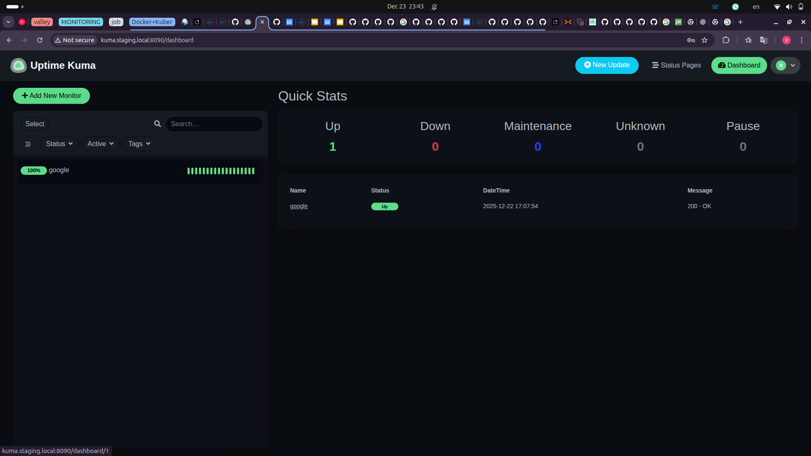

Курсовий проєкт:Uptime Kuma
Виконав: Владислав Войтенко

1. Короткий опис проєкту
Цей репозиторій є єдиним джерелом правди для розгортання та керування застосунком для моніторингу Uptime Kuma у Kubernetes. Проєкт реалізовано за методологією GitOps з використанням Flux CD.
Ключові компоненти стеку:
Застосунок: Uptime Kuma (Open-source моніторинг).
База даних: MariaDB, розгорнута за допомогою офіційного Helm-чарту від Bitnami.
Оркестрація: Kubernetes (Rancher Desktop).
Автоматизація: Flux CD для автоматичної синхронізації стану кластера з цим Git-репозиторієм.
Конфігурація: Helm для пакетування та шаблонізації.
Середовища: Налаштовано два ізольованих середовища:
staging: Для тестування (1 репліка Uptime Kuma, 1 інстанс MariaDB).
production: Для "бойового" використання (автоматичне масштабування Uptime Kuma через HPA, відмовостійкий кластер MariaDB).
Будь-яка зміна в цьому репозиторії (наприклад, git push в гілку main) автоматично застосовується до кластера без ручного втручання.

2. Підтвердження роботи системи
Нижче наведено вивід команд kubectl, що демонструє коректну роботу всіх компонентів системи після синхронізації Flux CD.

2.1. Статус Helm-релізів (flux get helmreleases -A)

Ця команда показує, що Flux успішно розгорнув та керує чартами MariaDB та Uptime Kuma в обох середовищах.
```bash
NAMESPACE   NAME            REVISION    SUSPENDED   READY   MESSAGE
production  mariadb-prod    19.0.2      False       True    Helm upgrade succeeded
production  uptime-kuma     2.24.0      False       True    Helm upgrade succeeded
staging     mariadb         19.0.2      False       True    Helm upgrade succeeded
staging     uptime-kuma     2.24.0      False       True    Helm upgrade succeeded
```
2.2. Статус Подів в обох неймспейсах (kubectl get pods -A)

Вивід демонструє різну конфігурацію реплік для staging та production, як і було заплановано.
Staging: 1 под Uptime Kuma, 1 под MariaDB.
Production: 2 поди Uptime Kuma (згідно з minReplicas в HPA), 2 поди MariaDB (1 primary, 1 secondary).
```bash
NAMESPACE    NAME                                      READY   STATUS    RESTARTS   AGE
production   mariadb-prod-primary-0                    1/1     Running   0          45m
production   mariadb-prod-secondary-0                  1/1     Running   0          44m
production   uptime-kuma-57b6f6465d-rwdjc              1/1     Running   0          42m
production   uptime-kuma-57b6f6465d-rwdjc              1/1     Running   0          42m
staging      mariadb-0                                 1/1     Running   0          55m
staging      uptime-kuma-57b6f6465d-xgvxr              1/1     Running   0          53m
```
2.3. Статус Ingress'ів (kubectl get ingress -A)

Команда підтверджує, що для кожного середовища створено унікальну точку входу (Ingress) з відповідним хостом.
```bash
NAMESPACE    NAME          CLASS     HOSTS                ADDRESS     PORTS   AGE
production   uptime-kuma   traefik   kuma.prod.local      localhost   80      42m
staging      uptime-kuma   traefik   kuma.staging.local   localhost   80      53m
```
2.4. Демонстрація роботи (скріншоти)

Інтерфейс Uptime Kuma у production середовищі:


